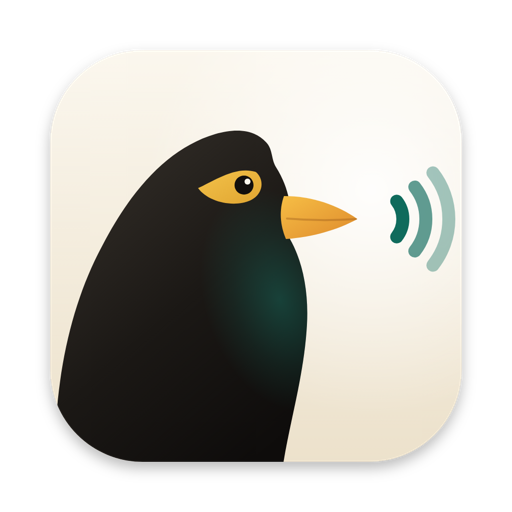

<p align="center">


[Approved icon and brand assets](dist/brand/README.md)
</p>

<h1 align="center">Myna</h1>

<p align="center">
  <b>Your eyes are tired. Your Mac can read.</b><br>
  Select text anywhere, press <kbd>⌘⌥⇧S</kbd>, and a natural voice reads it to you, generated right on your Mac.
</p>

<p align="center">
  <a href="https://myna.prerakgada.in/download"><b>Download for Mac</b></a> ·
  <a href="https://myna.prerakgada.in">Website</a> ·
  <a href="https://github.com/PrerakGada/Myna/releases">Releases</a>
</p>

---

Myna is a free, open-source menu-bar app for Apple Silicon Macs. It reads any
selection, any Chrome article, and every finished Claude Code reply aloud in a
Kokoro voice that runs locally through Apple's MLX, with no cloud speech
service, no account and no subscription.

## Install

1. **[Download Myna.dmg](https://myna.prerakgada.in/download)** (about 4 MB, signed and notarized) and drag Myna into Applications.
2. **Open Myna.** On first launch it installs its voice into your user account, with each step shown as it goes: a private Python runtime, the MLX speech engine and the Kokoro model. That's about 1 GB and a few minutes. No Terminal, no Homebrew, no admin password.
3. **Allow Accessibility** when asked (Myna needs it to copy your selection), then select something and press <kbd>⌘⌥⇧S</kbd>.

**Requirements:** Apple Silicon (M1 or later), macOS 14 Sonoma or later, about 1 GB of free space.

<details>
<summary>Install with Homebrew instead</summary>

```sh
brew tap prerakgada/tap
brew trust prerakgada/tap          # Homebrew 6+ asks you to trust third-party taps
brew install --cask prerakgada/tap/myna
```

The cask installs the app and its background service (`myna-daemon`) and adds
the `myna` command. Open Myna once afterwards to finish setting up the voice.
</details>

<details>
<summary>Optional: summaries</summary>

<kbd>⌘⌥⇧A</kbd> summarizes the selection with a local model before reading it. It needs Ollama:

```sh
brew install ollama
ollama pull qwen3.5:4b
```
</details>

## What it does

- **Read any selection.** <kbd>⌘⌥⇧S</kbd> in any app you can copy text from: browsers, PDFs, mail, Slack, terminals.
- **Read articles.** <kbd>⌘⌥⇧R</kbd> reads the front tab of Google Chrome, with the navigation and clutter stripped out.
- **Claude Code replies.** When a session finishes, its reply appears in Myna's player as *New output ready*. Play reads the whole reply; parallel sessions come one at a time and wait in the menu bar, tagged by project.
- **A floating player.** While Myna reads, a slim bar sits at the bottom of the screen. Hover to scrub, skip ten seconds, pause, or change speed up to 2× without changing pitch. Drag it anywhere.
- **The menu bar.** Now playing, voice, speed, pending Claude replies, and your last five reads with one-click replay.
- **Four voices.** Heart (default), Bella, Michael and Adam, all Kokoro US English. Preview them in Settings → Voice.
- **Trackpad gestures** (opt-in). A four-finger press-and-hold or tap reads the selection, with a soft tone when it's recognized; a four-finger double-tap stops.
- **Automation.** `myna://` links for Shortcuts, Raycast, Alfred and BetterTouchTool.
- **Updates itself** through Sparkle, with signed releases from GitHub.

## Shortcuts

All rebindable in **Settings → Hotkeys**.

| Action | Default |
|---|---|
| Read the selection | <kbd>⌘⌥⇧S</kbd> |
| Summarize the selection (needs Ollama) | <kbd>⌘⌥⇧A</kbd> |
| Read the Chrome article | <kbd>⌘⌥⇧R</kbd> |
| Pause / resume | <kbd>⌘⌥⇧Space</kbd> |
| Stop | <kbd>⌘⌥⇧.</kbd> |
| Previous / next sentence | none: record one in the Shortcuts pane |

## Automation

```sh
open myna://speak-selection            # add ?mode=summary for a summary
open myna://read-chrome
open myna://toggle-pause
open myna://stop
open "myna://seek?delta=-15"
open "myna://speed?value=1.5"          # or ?delta=0.25
```

Homebrew installs also get a CLI:

```sh
myna "Read this aloud."
pbpaste | myna
myna --summary "Long text to condense first."
myna doctor                            # are the daemon and engine up?
```

## Privacy

The voice is generated on your Mac, so the text you read is never sent to a
speech service, and there is no analytics or telemetry. Myna uses the network
in four specific cases:

- **Setup** downloads uv and Python (GitHub), the engine packages (PyPI) and the Kokoro model (Hugging Face).
- **Updates** are checked against GitHub Releases by Sparkle.
- **Read article** has the daemon fetch that page from the web, as your browser did.
- **Report a Problem… / Send Feedback…** sends what you typed in that form (your
  name and email only if you added them) to Prerak's server, `api.prerakgada.in`,
  with the app version, build, macOS version and Mac model. Nothing goes until
  you press Send, and the form lists exactly what goes with your message. Like
  any web request it arrives from your IP address; the server stores no IP, only
  the rough location (country, region, city) its network edge reports.

The daemon and the engine listen on `127.0.0.1` only. Summaries go to Ollama on
your own Mac.

## How it works

```
Selection · hotkey · gesture · myna:// · Claude Code hook
                         ↓
   Myna.app     menu bar, floating player, Settings, AVAudioEngine playback
                         ↓  HTTP on 127.0.0.1:8766
   daemon       Python/FastAPI: chunking, article extraction, summaries, streaming
                         ↓  supervises
   engine       mlx-audio + Kokoro-82M on 127.0.0.1:8765
```

## Where things live

| What | Where |
|---|---|
| App | `/Applications/Myna.app` |
| Voice engine | `~/.venvs/mlx-audio` |
| Daemon (disk-image install) | `~/.venvs/myna-daemon`, run by `~/Library/LaunchAgents/dev.myna.daemon.plist` |
| Private Python + uv | `~/Library/Application Support/Myna/runtime` |
| Kokoro model | `~/.cache/huggingface/hub/models--prince-canuma--Kokoro-82M` |
| Settings | `~/.config/myna/` |
| Logs | `~/Library/Logs/Myna/` (app, setup) and `~/Library/Logs/myna-{daemon,engine}.log` |

To uninstall completely, quit Myna, drag it to the Trash, and run:

```sh
launchctl bootout gui/$(id -u)/dev.myna.daemon
rm -rf ~/Library/LaunchAgents/dev.myna.daemon.plist ~/.venvs/myna-daemon ~/.venvs/mlx-audio \
  ~/Library/Application\ Support/Myna ~/.config/myna \
  ~/.cache/huggingface/hub/models--prince-canuma--Kokoro-82M
```

If you connected Claude Code, also remove the `myna-cc-announce.py` entry from
`~/.claude/settings.json`. Homebrew: `brew uninstall --cask myna && brew uninstall myna-daemon`.

## Develop

```sh
git clone https://github.com/PrerakGada/Myna && cd Myna
just --list          # build, test, lint, dev loop
just ci              # everything CI runs
```

The repo holds the Swift app (`apps/macos`), the Python daemon (`daemon`), the
website (`site`), the CLI (`cli`), and the release tooling (`dist`, `.github`).
Architecture notes are in [`docs/`](docs/); the release process is in
[`RELEASE.md`](RELEASE.md).

## License

[MIT](LICENSE). Made by [Prerak Gada](https://github.com/PrerakGada).
